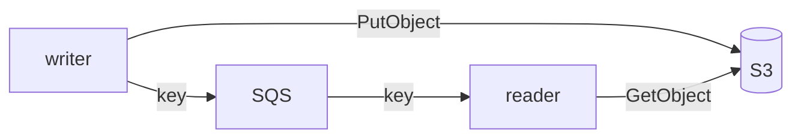

# fargate-s3

Two ECS Fargate roles sharing one image, selected by `SMOKE_ROLE`:

- **writer** — one-shot: payload → S3, then key → SQS.
- **reader** — long-running service: SQS → fetch from S3 → log → delete.



## Prerequisites

- Docker (with buildx), OpenTofu (or Terraform), AWS CLI v2 + creds in env
- aws-gleam SDK ≥ 1.4.0 — `s3.new` / `sqs.new` / `env.get_env`

## Setup

```sh
eval "$(aws configure export-credentials --format env)"
export AWS_REGION=eu-central-1
# bucket name is globally unique:
printf 'bucket_name = "aws-gleam-smoke-<acct>"\nregion = "eu-central-1"\n' > infra/terraform.tfvars
```

## Run locally

Plain BEAM app — no emulator. It just needs a real bucket + queue:

```sh
( cd infra && tofu init >/dev/null && tofu apply -auto-approve \
    -target=aws_s3_bucket.smoke -target=aws_sqs_queue.smoke )
export SMOKE_BUCKET=$(cd infra && tofu output -raw bucket_name)
export SMOKE_QUEUE_URL=$(cd infra && tofu output -raw queue_url)

SMOKE_ROLE=writer SMOKE_PAYLOAD=hi gleam run   # writes + enqueues, exits
SMOKE_ROLE=reader gleam run                    # fetches + logs; Ctrl-C then `a` to quit
```

## Deploy

```sh
./build.sh                 # build image -> ECR -> tofu apply (cluster + tasks + bucket + queue)
./run.sh "hello fargate"   # run one writer task + tail the logs
```

## Tear down

```sh
cd infra && tofu destroy -auto-approve
```
