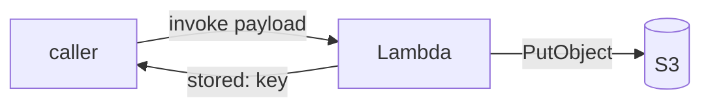

# lambda-s3

Directly-invoked Lambda that stores each invocation payload in S3 under `events/<request-id>.json`, replying `{"stored":"<key>"}`.

```gleam
pub fn main() {
  let assert Ok(client) = s3.new()
  let assert Ok(bucket) = env.get_env("BUCKET_NAME")
  lambda.run(fn(payload, ctx) { store(client, bucket, payload, ctx) })
}
```



`lambda.run` polls the Lambda Runtime API in the cloud; run any other way (`gleam run`) it invokes the handler once and exits — same code, no emulator.

## Prerequisites

- Docker (with buildx), OpenTofu (or Terraform), AWS CLI v2 + creds in env
- aws-gleam SDK ≥ 1.4.0 — `s3.new` / `lambda.run` / `env.get_env`

## Run locally

Hits real S3 with your creds; point it at any bucket you own:

```sh
eval "$(aws configure export-credentials --format env)"
export AWS_REGION=eu-central-1 BUCKET_NAME=<a-bucket>

gleam run                          # event = {}
gleam run -- --event '{"hi":1}'    # or: LAMBDA_EVENT='{...}' gleam run
```

Off-Lambda the request id is `local`, so the object lands at `events/local.json`.

## Deploy + verify

```sh
# bucket name is globally unique:
printf 'bucket_name = "aws-gleam-lambda-s3-<acct>"\nregion = "eu-central-1"\n' > infra/terraform.tfvars

./build.sh                     # build arm64 image -> ECR -> tofu apply
./run.sh '{"hello":"cloud"}'   # invoke the deployed fn, read the object back
```

## Tear down

```sh
cd infra && tofu destroy -auto-approve
```
